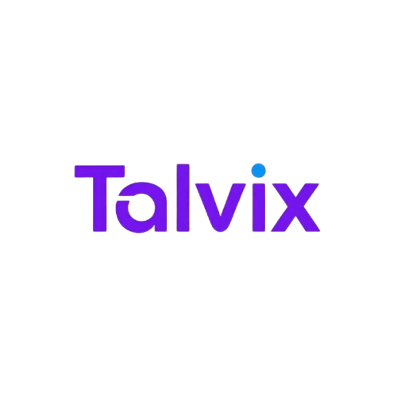

<p align="center">
  
</p>

<h1 align="center">Talvix</h1>

<p align="center">
  <strong>The Ultimate AI-Powered Career Intelligence & Interview Preparation Platform</strong>
</p>

---

## 📖 About Talvix
Talvix is an advanced, full-stack application designed to streamline the transition from learning to earning. By leveraging state-of-the-art AI, Talvix identifies your professional skill gaps, generates personalized learning roadmaps, and provides a safe environment for high-stakes interview practice.

---

## 🎤 Main Features

### 1. Conversational AI Mock Interviews
Practice in a realistic, high-pressure environment with our **AI Recruiter**.
- **Natural Dialogue**: Powered by Mistral AI, the interviewer listens, reacts, and asks follow-up questions based on your specific answers.
- **Voice-Enabled**: Fully integrated **Speech-to-Text** and **Text-to-Speech** for a hands-free, immersive experience.
- **Turn-by-Turn Feedback**: Immediate comparisons with "Ideal Answers" and performance scoring for every response.

### 2. Live Job Market Analysis
Stay ahead of the competition with real-time industry data.
- **Economic Indicators**: Tracks role demand, salary benchmarks, and recession risks.
- **Role-Speific Insights**: Deep dives into specific technologies and companies to help you target the right opportunities.
- **Visual Analytics**: Interactive Recharts dashboards showing growth trends and market readiness.

### 3. AI Resume & Skill Assessment
Stop guessing about your profile's strength.
- **Automated Resume Audit**: NLP-driven extraction of skills and experience to find precisely what's missing.
- **Interactive Skill Tests**: Validate your expertise with AI-generated assessments and track your scores over time.
- **JD Matching**: Upload a job description to see an instant "Compatibility Score" between your profile and the role requirements.

### 4. Smart Roadmap Generation
- **Bridge the Gap**: Automatically generates a 4-week intensive study plan based on your identified missing skills.
- **Direct Resources**: No more searching—get curated links to official docs, top YouTube tutorials, and LeetCode problems.

---

## 🛠️ Tech Stack

### Frontend
- **Framework**: Next.js 15+ (App Router, Turbopack)
- **Styling**: Tailwind CSS & Framer Motion (Premium UI Animations)
- **Data Viz**: Recharts (Modern Dashboard Analytics)

### Backend
- **Framework**: FastAPI (High-performance Python)
- **Database**: PostgreSQL with SQLAlchemy ORM
- **AI Engines**: Mistral AI (Primary) & Google Gemini (Fallback)
- **NLP**: spaCy, NLTK, and Scikit-learn

---

## 🚀 Step-by-Step Setup Guide

### 1. Repository Setup
Clone the project and enter the directory:
```bash
git clone https://github.com/vamshikrishnasai/Talvix.git
cd Talvix
```

### 2. Backend Initialization
1. Navigate to the backend folder:
   ```bash
   cd backend
   ```
2. Create and activate a virtual environment:
   ```bash
   python -m venv venv
   # On Windows:
   venv\Scripts\activate
   ```
3. Install required libraries:
   ```bash
   pip install -r requirements.txt
   python -m spacy download en_core_web_sm
   ```
4. Configuration: Create a `.env` file and add your API keys (Mistral, Gemini) and DB URL.
5. Initialize the database:
   ```bash
   python -m app.init_db
   ```
6. Run the API:
   ```bash
   uvicorn app.main:app --reload
   ```

### 3. Frontend Initialization
1. In a new terminal, navigate to the frontend:
   ```bash
   cd frontend
   ```
2. Install dependencies:
   ```bash
   npm install
   ```
3. Launch the web app:
   ```bash
   npm run dev
   ```

---

## 📊 Project Preview
Enjoy a premium, dark-themed experience designed for focus and productivity. Talvix is built to be your personal career co-pilot.

**Developed by**: [Vamshi Krishna Sai](https://github.com/vamshikrishnasai)
